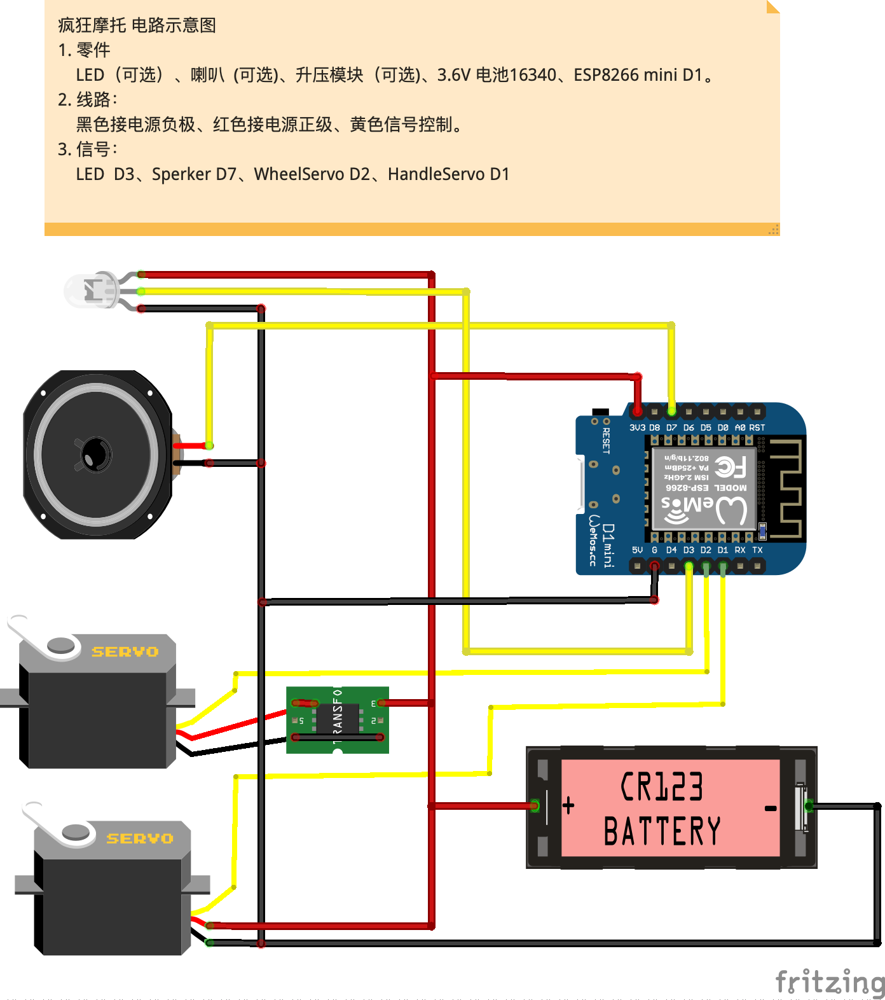
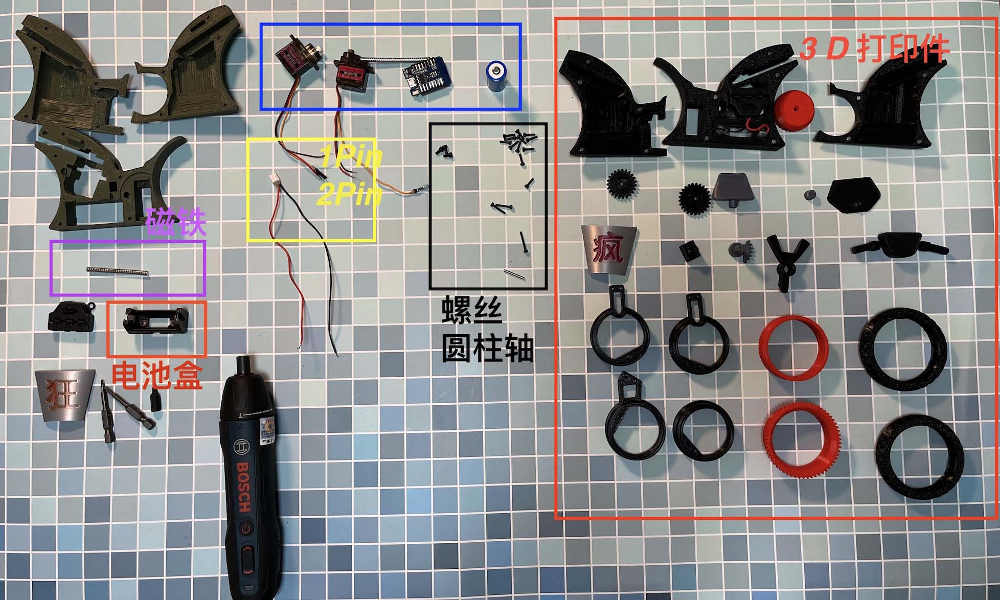
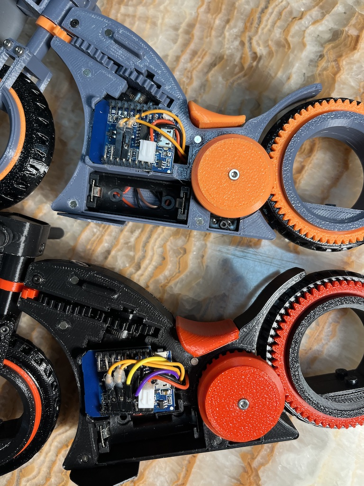

# 疯狂摩托

## 视频
* B站 地址：https://www.bilibili.com/video/BV1vY411n7LY

## 主要材料清单
* M2 x 18 圆柱轴 x1
*  螺丝
	*  M2 x 8   x1
	*  M2 x 12 螺丝  x1
	*  M2 x 16 螺丝  x 1
	*  M2.5 x 5 螺丝 x 3
*  磁铁
	* 3mm x 2mm
*  端子
	*   XH2.54mm    2 Pin端子 x3
	*   1 Pin杜邦线端子 x3
*  电池 
	*  16340 锂电池 3.6v
	*  CR123A 电池盒
*  舵机
	* MG90s 90度 或者 90~180度 x1
	* MG90s 360度 x1
*  开发版
	* ESP8266 mini D1
* 可选件
	* 3.6v 生压5.0v （无特定产品，见视频）
	* LED 
	* 喇叭

## 3D 零件打印说明
* 推荐 PLA+  ，填充密度 50%
* 轮胎 TPU95 ,填充密度  30~40%

## 电路

###  V1.0  电路说明
*  不需要喇叭、LED。  
*  升压模块也是必须的（疯狂摩托速度会慢一些）

# Tips

* ESP8266 mini 引脚需要剪短或者折弯（建议折弯）
* 会有一些额外的孔位协助固定，可以不用

## 参考

1. 3D Funs Hubless Bike_Arduino RC
https://www.thingiverse.com/thing:4964884

 疯狂摩托 框架尺寸参考了 3D funs  设计 所有零件全部重新建模设计。